# Scratch Aufgabe

Ein Spiel wie "Cookie Clicker"

<!--_paginate: false -->

---

## Part 1

- Video zur Lösung

  <iframe width="704" height="396" src="https://player.vimeo.com/video/310932395?h=992b0cb706" frameborder="0" allow="accelerometer; autoplay; clipboard-write; encrypted-media; gyroscope; picture-in-picture; web-share" referrerpolicy="strict-origin-when-cross-origin" allowfullscreen></iframe>

---

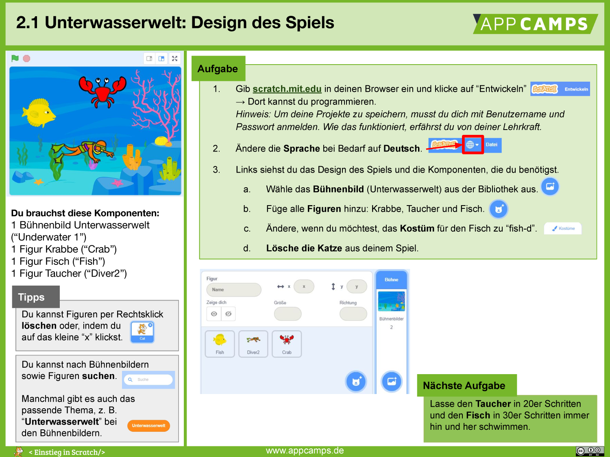

---

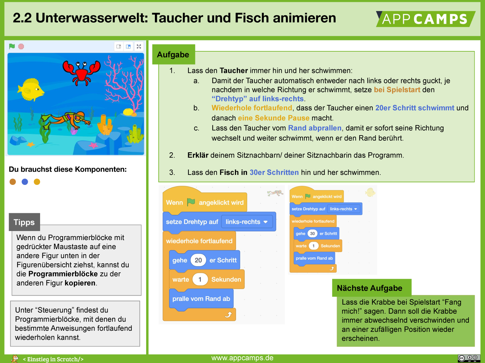

---

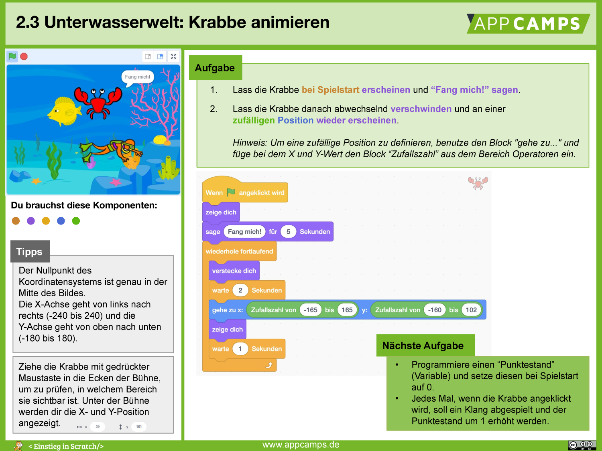

---

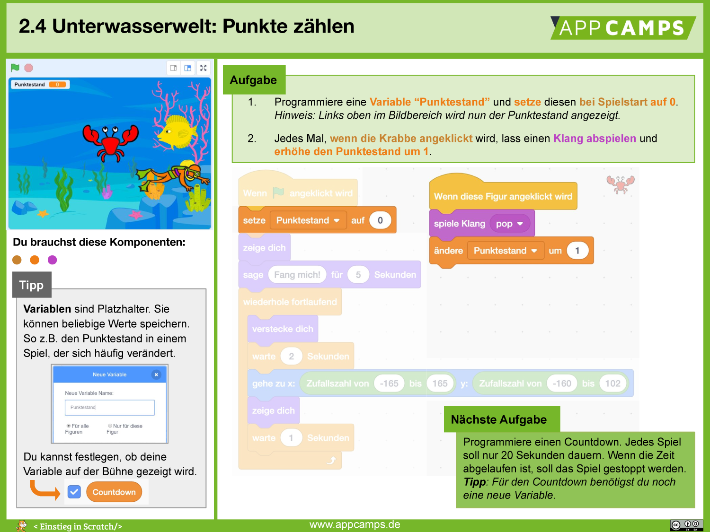

---

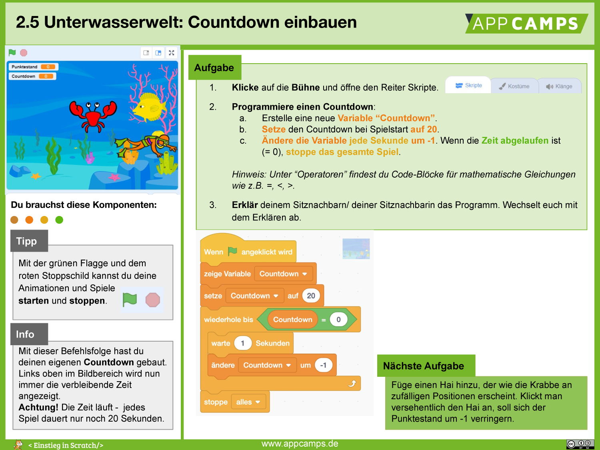

---

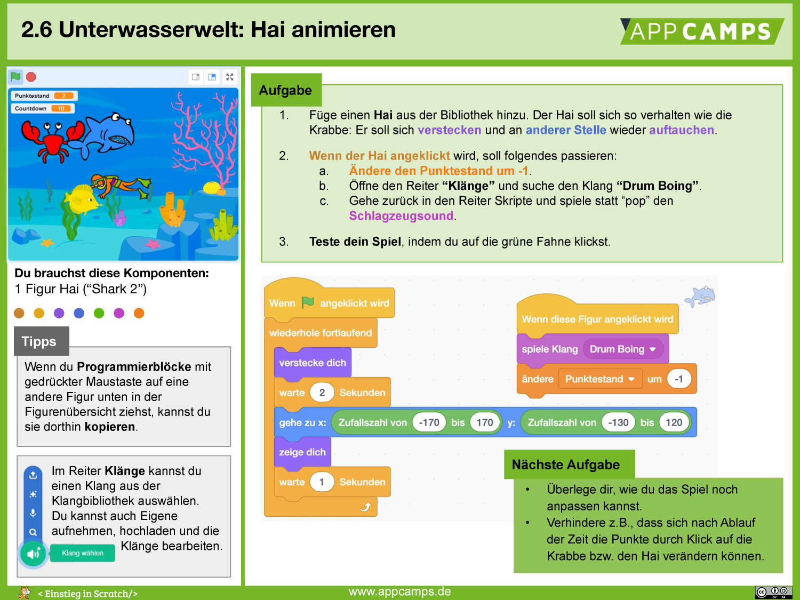

---

### Musterlösung - Part 1

  <iframe src="https://scratch.mit.edu/projects/276879388/embed" allowtransparency="true" width="485" height="402" frameborder="0" scrolling="no" allowfullscreen></iframe>

  [Link zur Lösung](https://scratch.mit.edu/projects/276879388)

---

## Part 2

### Verbesserungen

- Gleitende Bewegung für Fisch und Taucher
- Möglichkeit Fisch und Taucher ein und auszuschalten
- Verbesserung der Krabbe
- Endbildschirm

**ACHTUNG: Die folgenden iframes funktionieren nicht in allen Browsern! Mozilla Firefox auf Windows 10 hat nicht funktioniert.**

---

#### Gleitende Bewegung

  

    <iframe src="https://scratch.mit.edu/projects/1181839453/embed" allowtransparency="true" width="485" height="402" frameborder="0" scrolling="no" allowfullscreen></iframe>
  

  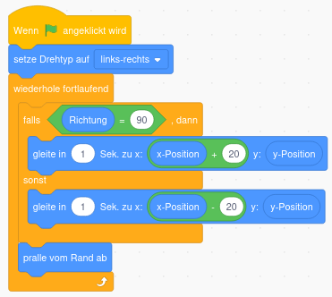

<!--

<iframe src="https://scratch.mit.edu/projects/1181839453/embed" allowtransparency="true" width="485" height="402" frameborder="0" scrolling="no" allowfullscreen></iframe> -->

---

#### Animationen ein/ausschalten

  

    <iframe src="https://scratch.mit.edu/projects/1183662726/embed" allowtransparency="true" width="485" height="402" frameborder="0" scrolling="no" allowfullscreen></iframe>
  

  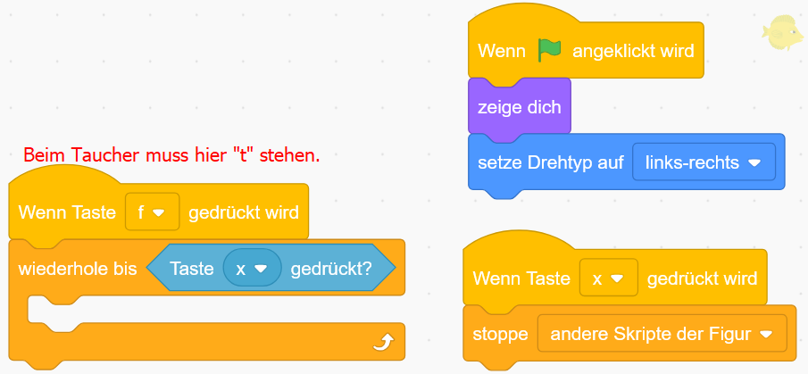

---

#### Verbesserung der Krabbe

  

    <iframe src="https://scratch.mit.edu/projects/1183694396/embed" allowtransparency="true" width="485" height="402" frameborder="0" scrolling="no" allowfullscreen></iframe>
  

  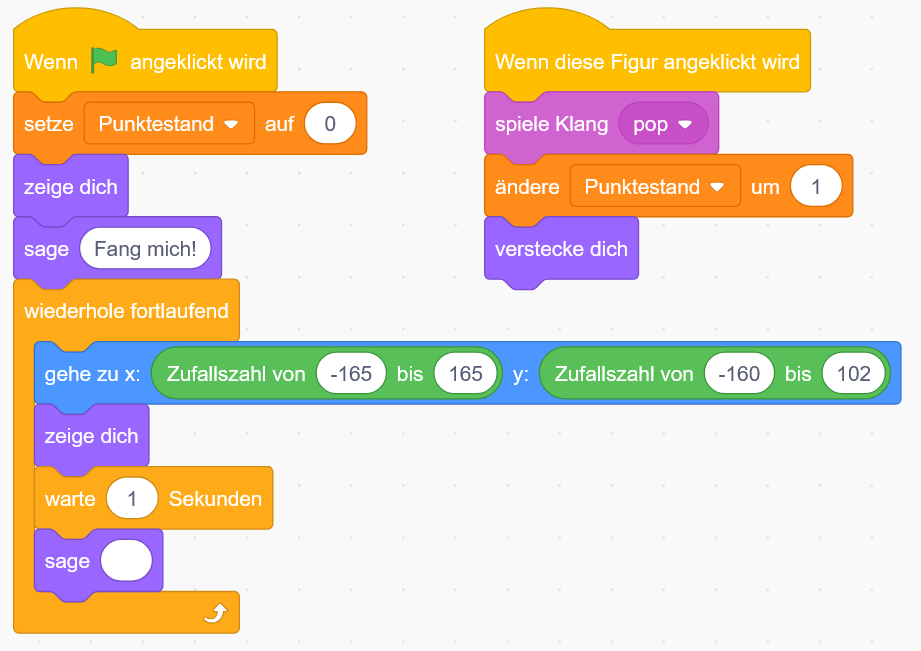

---

#### Endbildschirm [1]

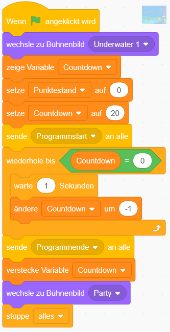

- Für den Endbildschirm muss das gesamte Programm überarbeitet werden.
- Wir beginnen mit dem Hintergrundbild und fügen dort ein Ereignis für Programmstart und Programmende hinzu.

---

#### Endbildschirm [2]

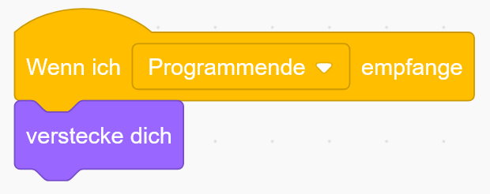

- Bei Fisch und Taucher sind die Änderungen einfach.
- Hier reicht es diesen Block hinzuzufügen.
- So wird verhindert, dass Fisch und Taucher beim Endbildschirm weiterschwimmen.

---

#### Endbildschirm [3]

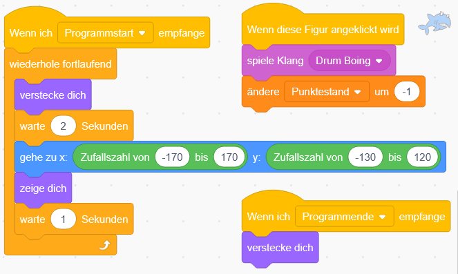

- Beim Hai muss zuerst das gleich wie bei Fisch und Taucher eingefügt werden.
- Danach muss noch der "Wenn Flagge angeklickt wird" Block durch den "Wenn ich Programmstart empfange" ausgetauscht werden.

---

#### Endbildschirm [4]

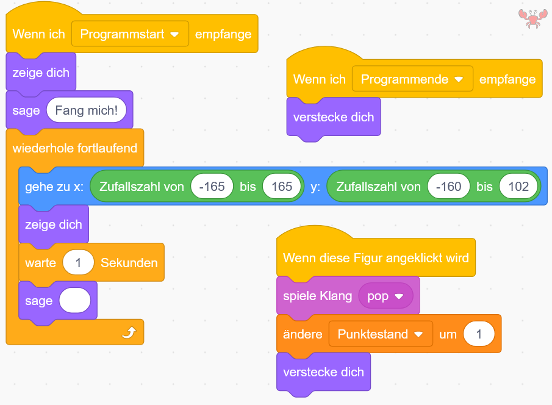

- Bei der Krabbe muss im Grunde das gleiche wie beim Hai geändert werden.

---

### Musterlösung für Part 2

  <iframe src="https://scratch.mit.edu/projects/1183698274/embed" allowtransparency="true" width="485" height="402" frameborder="0" scrolling="no" allowfullscreen></iframe>

  [Link zur Lösung](https://scratch.mit.edu/projects/1175949557)

