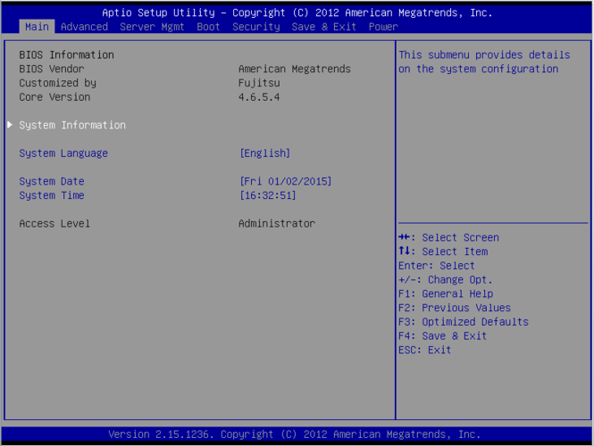

# Hardware

---

<!-- 
header: / Hardware
-->

## Komponenten

- Netzteil (intern/extern)
- Mainboard
- BIOS (**B**asic **I**nput/**O**utput System)
- CPU (**C**entral **P**rocessing **U**nit)
- RAM (**R**andom **A**ccess **M**emory)
- Speicher
  - HDD (**H**ard **D**isc **D**rive)
  - SSD (**S**olid **S**tate **D**rive)
- GPU (**G**raphics **P**rocessing **U**nit)

<!-- Jeder Computer hat die folgenden Komponenten. Ein Handy und ein Laptop sind auch Computer. Netzteile können auch extern angeschlossen sein. Dann ist allerdings ein Akku notwendig. -->

---

<!-- 
header: / Hardware / Komponenten
-->

### Netzteil

Das Netzteil versorgt das Gerät mit Strom. Es wandelt den Netzstrom aus der Steckdose so um, dass das Gerät damit betrieben werden kann.

---

### Mainboard

Das Mainboard ist die Hauptplatine des Computers. Das Mainboard ist das Verbindungsstück zu allen anderen Bauteilen.

<!-- 
Theoretisch könnte man auch alle Bauteile mit Kabeln verbinden. Dann hätten wir aber einen riesigen Kabelsalat im Gerät.

WICHTIG: Mainboard mitnehmen, damit sie sich was unter einer PLATINE (Kabeln auf einer Platte (Eine Art Kabelbaum)) vorstellen können.

 -->

---

### BIOS

- Steht für **B**asic **I**nput/**O**utput **S**ystem.
- Das BIOS ist ein Chip auf dem Mainboard.
- Es ist die Hauptkomponente, die für das Starten des Geräts verantwortlich wird.
- Das BIOS also der Übergang von Hardware zur Software.
- Das BIOS veranlasst das Laden des Betriebssystems. (Boot Prozess)

<!-- 
Ein Chip ist ein Bauteil auf einer Platine.

(Das Laden des Betriebsystems nennen wir Boot Prozess.

 -->

---

### CPU

- Steht für **C**entral **P**rocessing **U**nit
- Die CPU ist das Gehirn des Computers.
- Die CPU verarbeitet die Daten, die von den anderen Bauteilen kommen.

---

### RAM

- Steht für **R**andom **A**ccess **M**emory
- Der RAM ist das Kurzzeitgedächtnis des Computers.
- Der RAM speichert die Daten, die von der CPU verarbeitet werden zwischen.
- Der RAM ist flüchtig. Das bedeutet, dass die Daten im RAM verloren gehen, wenn der Computer ausgeschaltet wird.

---

### Speicher

- Der Speicher ist das Langzeitgedächtnis des Computers.
- Hier werden die Daten dauerhaft abgelegt. (z.B. Dokumente, Bilder, Videos, Programme)
- Der Speicher ist nicht flüchtig. Das bedeutet, dass die Daten im Speicher erhalten bleiben, wenn der Computer ausgeschaltet wird.

---

<!-- 
header: / Hardware / Komponenten / Speicher
-->

#### Speicherarten

- HDD (Hard Disc Drive)
  Langsamer Speicher, der auf rotierenden Scheiben basiert. Daten werden magnetisch gespeichert.
  - Langfristig sicherer Speicher
  - Anfällig für Stöße und Erschütterungen
- SSD (Solid State Drive)
  Schneller Speicher, der auf Flash-Speicher basiert. Daten werden elektronisch gespeichert.
  - Nicht so gut für langfristige Speicherung
  - Weniger anfällig für Stöße und Erschütterungen

<!-- 
Magnetplatten depolarisieren sich über Zeit.

Flash Specher entläd sich über Zeit → schneller als Depolarisierung
 -->

---

<!-- 
header: / Hardware / Komponenten
-->

### GPU

- Steht für **G**raphics **P**rocessing **U**nit
- Die GPU ist für die Berechnung und Darstellung von Grafiken zuständig.
- Die GPU ist besonders wichtig für Spiele und Anwendungen, die viel Grafikleistung benötigen. (z.B. Spiele, Videoschnitt)
- Die GPU kann auch für andere Berechnungen genutzt werden, die nicht direkt mit Grafiken zu tun haben. (z.B. Künstliche Intelligenz, Simulationen)

<!-- 
In der Grafik sind viele Matrix und Vektorberechnungen notwendig. GPUs sind darauf gebaut möglichst schnell Matrix und Vektorberechnungen durchzuführen.
 -->

---

## Anschlussmöglichkeiten

- USB
- Display
- Audio

---

<!--
header: / Hardware / Komponenten / Anschlussmöglichkeiten
-->

### USB

- Steht für **U**niversal **S**erial **B**us
- USB ist ein Standard für die Verbindung von externen Geräten mit dem Computer. (z.B. Tastatur, Maus, Drucker, externe Festplatte)

<!--
Seriel ist dabei die Art und Weise, wie die Daten übertragen werden. (Daten werden nacheinander übertragen)
 -->

---

<!--
header: / Hardware / Komponenten / Anschlussmöglichkeiten / USB
-->

#### USB Versionen (Einfach)

- USB 1.0
  - 12 Mbit/s
  - 4 Pins
- USB 2.0
  - 480 Mbit/s
  - 4 Pins
- USB 3.0
  - 5120 Mbit/s
  - 9 Pins

---

#### USB Versionen (Wahnsinn)

- USB 1.0
- USB 1.1
- USB 2.0
- USB 3.0 / 3.1 Gen 1
- USB 3.1 Gen 2
- USB 3.2 Gen 1x1
- USB 3.2 Gen 1x2
- USB 3.2 Gen 2x1
- USB 3.2 Gen 2x2

<!--
https://www.youtube.com/watch?v=gShRBsahzXg
 -->

---

#### USB Stecker Typen

- USB 2.0
  - Typ A
  - Typ B
  - Mini
    - Typ A
    - Typ B
  - Micro
    - Typ A
    - Typ B
- USB 3.0
  - Typ A
  - Typ B
  - Micro
  - Typ C

---

#### USB Spezifikationen

- USB QC (Quick Charge)
- USB PD (Power Delivery)
- USB QI (Wireless Charging)
- USB OTG (On-The-Go)

---

### display

- vga
- dvi
- hdmi
    - mini
    - micro
- display port
    - mini

---
    
### audio

- chinch
- aux
- xlr

---

## laufwerke

- casette
- diskette
- zip
- cd
- dvd
- blueray

---

# input output

- Die Tastatur
  - Besondere Tasten
    - Leertaste
    - Shift
    - Caps Lock
    - Strg
    - Alt
    - Tab
    - Enter
    - Esc
    - Pfeiltasten
    - Backspace
    - Delete
    - Funktionstasten (F1-F12)
      - [ ] F1 (Hilfe)
      - [x] F2 (Umbenennen)
      - [ ] F3 (Suchen)
      - [ ] F4 (Adressleiste)
      - [x] F5 (Aktualisieren)
      - [ ] F6 (Wechseln zwischen Fenstern)
      - [ ] F7 (Rechtschreibprüfung)
      - [ ] F8 (Startoptionen)
      - [ ] F9 (Aktivieren von Funktionen)
      - [ ] F10 (Menüleiste aktivieren)
      - [x] F11 (Vollbildmodus)
      - [ ] F12 (Entwicklertools)
    - Windows-Taste
  - Sonderzeichen
  - Tastenkombinationen
    - Strg + C (Kopieren)
    - Strg + V (Einfügen)
    - Strg + X (Ausschneiden)
    - Strg + Z (Rückgängig)
    - Strg + Y (Wiederholen)
    - Strg + A (Alles auswählen)
    - Strg + S (Speichern)
    - Windows + P (Projektionsmodus wechseln)
    - Windows + L (Computer sperren)
    - Strg + Alt + Entf (Sicherheitsoptionen öffnen)
    - Alt + Tab (Wechseln zwischen offenen Anwendungen)
    - Alt + F4 (Aktuelles Fenster schließen)
- Die Maus
  - Linksklick
  - Rechtsklick
  - Doppelklick
  - Scrollen
  - Drag & Drop
