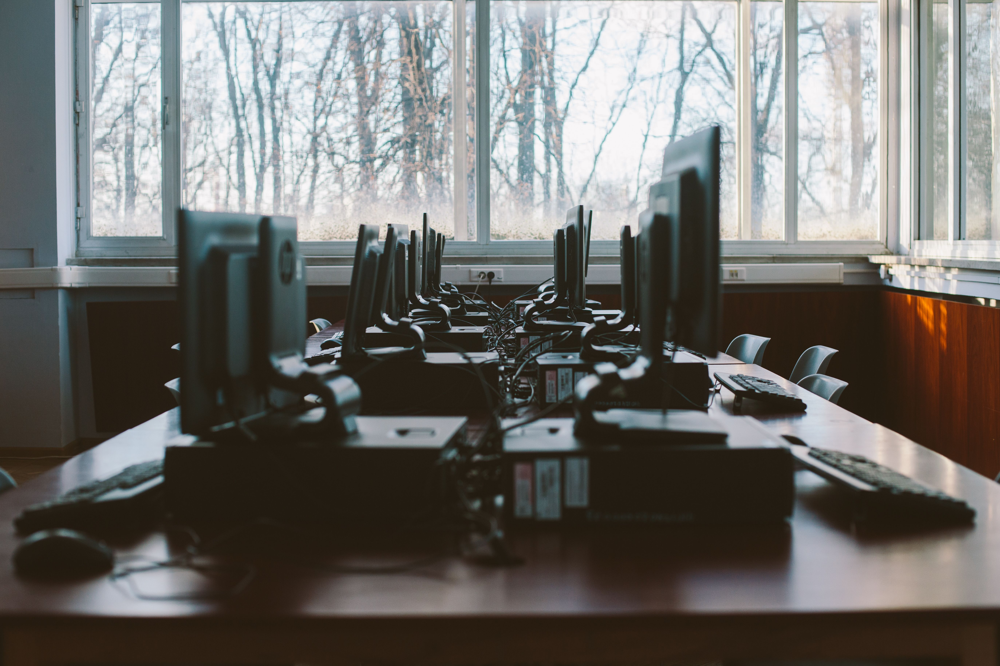

# Organisatorisches

*Digitale Grundbildung 2. Klasse*

---

## Regeln für den EDV-Saal [Teil 1]

1) Das Mitnehmen von Essen und Trinken ist verboten.
2) Wir melden uns erst beim PC an, wenn es erlaubt wurde.
3) Wir arbeiten nur an unserem PC, außer es braucht jemand Hilfe und der Lehrkörper hat es erlaubt.
4) Wenn es Probleme gibt, zeigen wir auf.
5) Wir behandeln sämtliche Geräte sorgsam. Schäden müssen sofort gemeldet werden.
6) Wir dürfen keine Kabel hinausziehen und einstecken.

---

## Regeln für den EDV-Saal [Teil 2]

7) Wir halten unseren Arbeitsplatz sauber und ordentlich.
8) Wir dürfen nicht ungefragt das Internet öffnen.
9) Wenn Kopfhörer verwendet wurden, sind diese zurück in die vorgesehene Box zu stellen.
10) Vor dem Verlassen des Raumes muss der Arbeitsplatz ordentlich hinterlassen werden (Sessel hineinschieben etc.)
11) Die Lehrperson legt die Sitzordnung fest
12) Die Sitzordnung ist einzuhalten

---

## Sitzordnung

<!-- _footer: Bildquelle und Lizenz: https://www.pexels.com/photo/photo-of-computers-near-window-3747486/ -->

---

## Beurteilung

- Mitarbeit
    - **Zielgerichtetes und aufgabenbezogenes** Arbeiten während der Unterrichtszeit
    - Selbstständige **Erledigung** und **Abgabe** in einer **Lernplattform** von diversen Übungen
- 1 Test pro Semester (Dauer: 15 Minuten)

<!-- _footer: Das ausführliche Leistungsberteiungskonzept für Digitale Grundbildung kann [hier](https://oeversee.at/schule/leistungsbeurteilungskonzept) nachgelesen werden -->

---

## Themen

---

## Lernplattform