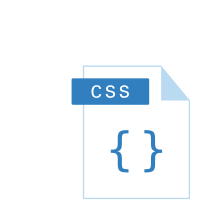
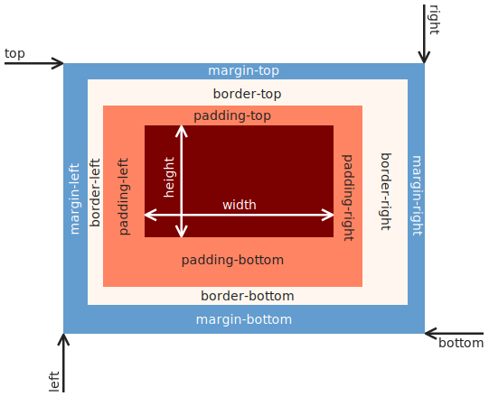

<style>
  img[alt~="rightbound"] {
    margin-top: -124px;
    height: 310px;
    margin-right: 150px;
    }
</style>

# CSS Grundlagen

_Martin Kleindienst_

<!--_paginate: false -->

---

## Motivation

Wie können wir sicherstellen, dass das Bild unseres HTML Dokuments immer eine passende Größe hat?

Es wäre doch praktisch, wenn sich die Bildgröße abhängig von der Fensterbreite verändert.

---

## CSS

<div style='float:right'>



</div>

- **C**ascading **S**tyle **S**heets
- Erstveröffentlichung: 1996
- Aktuelle Version: CSS3
- Dateiendung: .css
- CSS wird verwendet, um das Design und Layout von HTML-Dokumenten zu definieren!
- Kommentare werden mit `/*` zum Öffnen und `*/` zum Schließen erstellt

---

### Einbinden von "External CSS"

```html
<!DOCTYPE html>
<html>
  <head>
    <meta charset="utf-8" />
    <meta name="viewpoint" content="width=device-width, initial-scale=1.0" />
    <title>CSS is Awesome</title>
    <link rel="stylesheet" href="https://www.w3schools.com/w3css/5/w3.css" />
  </head>
  <style>
    /* Hier wäre Platz für "Internal CSS". Aber dazu auch gleich mehr */
  </style>
</html>w"><
```

---

### Einbinden von "Internal CSS"

```html
<!DOCTYPE html>
<html>
  <head>
    <meta charset="utf-8" />
    <meta name="viewpoint" content="width=device-width, initial-scale=1.0" />
    <title>CSS is Awesome</title>
  </head>
  <style>
    h1 {
      color: maroon;
      font-size: 40px;
    }
    .specialstyle {
      color: lightblue;
    }
  </style>
  <body>
    <h1>CSS is Awesome</h1>
    <p class="specialstyle">
      CSS macht es uns möglich unsere HTML Dokumente ansprechend zu gestalten.
    </p>
  </body>
</html>
```

---

### Einbinden von "Inline CSS"

```html
<!DOCTYPE html>
<html>
  <head>
    <meta charset="utf-8" />
    <meta name="viewpoint" content="width=device-width, initial-scale=1.0" />
    <title>CSS is Awesome</title>
  </head>
  <body>
    <h1 style="color: maroon; font-size: 40px">CSS is Awesome</h1>
    <p style="color: lightblue">
      CSS macht es uns möglich unsere HTML Dokumente ansprechend zu gestalten.
    </p>
  </body>
</html>
```

---

### Wie geht das jetzt mit dem Bild?

```html
<!DOCTYPE html>
<html>
  <head>
    <meta charset="utf-8" />
    <meta name="viewpoint" content="width=device-width, initial-scale=1.0" />
    <title>CSS is Awesome</title>
  </head>
  <body>
    <h1>CSS is Awesome</h1>
    
  </body>
</html>
```

---

### Einheiten

<div style="display: flex">
  <div style="flex: 1">
    <h4>Absolut</h4>
    <ul>
      <li>cm</li>
      <li>mm</li>
      <li>pt</li>
      <li>px</li>
      <li>...</li>
    </ul>
  </div>
  <div style="flex: 2">
    <h4>Relativ</h4>
    <ul>
      <li>% (Anteil an verfügbaren Platz)</li>
      <li>vw (Anteil der viewpoint Breite)</li>
      <li>vh (Anteil  der viewpoint Höhe)</li>
      <li>...</li>
    </ul>
  </div>
</div>

<!-- _footer: https://web.dev/learn/css/sizing -->

---

### CSS Boxmodell [1]



<!-- _footer: https://en.wikipedia.org/wiki/CSS_box_model#/media/File:Boxmodell-detail.png -->

---

### CSS Boxmodell [2]

```html
<style>
  .boxstyle {
    padding-top: 14px;
    padding-right: 44px;
    padding-bottom: 50px;
    padding-left: 80px;
    border-style: solid;
    border-width: 25px 10px 4px 35px;
    margin-top: 100px;
    margin-bottom: 100px;
    margin-right: 150px;
    margin-left: 80px;
  }
</style>
```

---

### Flex Boxes

```html
<style>
  .container {
    display: flex;
    flex-wrap: wrap;
  }
</style>
<body>
  <div class="container">
    <div>
      <h2>Linke Seite</h2>
    </div>
    <div>
      <h2>Rechte Seite</h2>
    </div>
  </div>
</body>
```

---

## Variablen [1]

In CSS können Variablen deklariert werden um beispielsweise eine Farbpalette nutzen zu können. [Diese Seite](https://www.realtimecolors.com/) kann dabei helfen.

```html
<style>
  :root {
    --text: FARBE1;
    --background: FARBE2;
    --primary: FARBE3;
    --secondary: FARBE4;
    --accent: FARBE5;
  }
</style>
```

--- 

## Variablen [2]

Um diese Variablen dann nutzen zu können muss folgendes geschrieben werden:

```html
<style>
    body {
        color: var(--text);
        background-color: var(--background);
  }
</style>
```

---

## Nützliche Links

- <https://www.free-css.com/free-css-templates>
- <https://www.realtimecolors.com/>
- <https://www.cdnfonts.com/>
- <https://yqnn.github.io/svg-path-editor/>


  