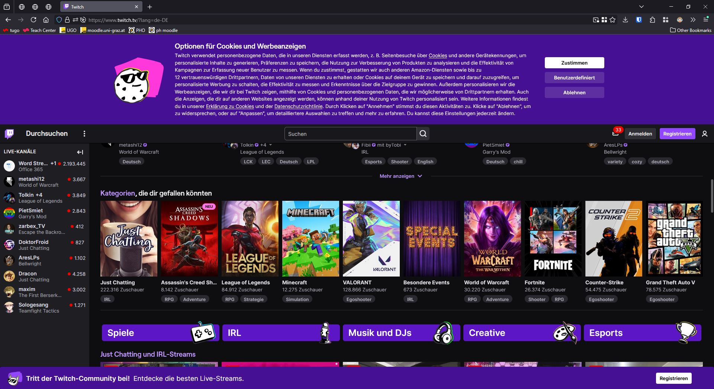

# Überblick

_Martin Kleindienst_

<!--_paginate: false -->

---

## Dateiendungen [1]

- Das was im Namen einer Datei nach dem Punkt steht.
- z.B. .docx für Word Dateien, .jpg für Kamerabilder oder .png für Webgrafiken.
- Müssen unter Windows im `Datei Explorer` standardmäßig erst sichtbar geschalten werden.

---

## Dateiendungen [2]

- Was ist der Unterschied zwischen einer **MS Word** Datei
  und einer **Zip** Datei?

- Ändere die Dateiänderung einer **MS Word** Datei auf **.zip** !

---

## ✏️ Tastenkombinationen [1]

| Tastenkombination      | Funktion                                                                        |
| ---------------------- | ------------------------------------------------------------------------------- |
| `STRG` + `A`           | 
 Alles markieren 
                               |
| `STRG` + `X`           | 
 Ausschneiden 
                                  |
| `STRG` + `C`           | 
 Kopieren 
                                      |
| `STRG` + `V`           | 
 Einfügen 
                                      |
| `STRG` + `Z`           | 
 Rückgängig machen 
                             |
| `STRG` + `Y`           | 
 Letzte Aktion wiederholen (Office, ...) 
       |
| `STRG` + `SHIFT` + `Z` | 
 Letzte Aktion wiederholen (Google Docs, ... ) 
 |

---

## 🖥️ Tastenkombinationen [2]

| Tastenkombination       | Funktion                                                  |
| ----------------------- | --------------------------------------------------------- |
| `WINDOWS` + `E`         | 
 Datei-Explorer öffnen 
   |
| `STRG` + `ALT` + `ENTF` | 
 Öffnet Sicherheitsmenü 
  |
| `WINDOWS` + `L`         | 
 Computer sperren 
        |
| `STRG` + `S`            | 
 Speichern 
               |
| `F2`                    | 
 Datei/Ordner umbenennen 
 |

---

## 🧭 Tastenkombinationen [3]

| Tastenkombination           | Funktion                                                                |
| --------------------------- | ----------------------------------------------------------------------- |
| `STRG` + `F`                | 
 Suche öffnen 
                          |
| `WINDOWS` + `P`             | 
 Einstellungen für mehrere Bildschirme 
 |
| `F5`                        | 
 Aktualisieren (z. B. Webseite) 
        |
| `TAB`                       | 
 Zum nächsten Eingabefeld springen 
     |
| `ALT` + `TAB`               | 
 Zwischen offenen Fenstern wechseln 
    |
| `STRG` + `+` (oder Mausrad) | 
 Hineinzoomen 
                          |
| `STRG` + `-` (oder Mausrad) | 
 Hinauszoomen 
                          |

---

## Google Search Operator

- `"genau ẁas ich suchen will"`
- `tokyo hotel band` vs. `tokyo hotel -band`
- `define:grafikkarte`vs. `$grafikkarte`
- `map graz fußball`
- `martin AND kleindienst` vs. `martin OR kleindienst`
- `wheather graz`
- `site:minecraft.wiki iron golem farm`

<!-- ---

## Regex -->

---

## HTML

<!--  -->

<svg width="1200" height="500" style="position: absolute; z-index: 2; margin-left: -55px; margin-top: -10px">

  <line x1="0" y1="170" x2="693" y2="0" stroke="gray" stroke-width="4"/>
  <line x1="80" y1="170" x2="1200" y2="0" stroke="gray" stroke-width="4" />
  <line x1="00" y1="235" x2="693" y2="450" stroke="gray" stroke-width="4" />
  <line x1="80" y1="235" x2="1200" y2="450" stroke="gray" stroke-width="4" />
</svg>

---

## Image Sources

- https://pixabay.com/vectors/zip-compressed-icon-archive-win-7040223/
- https://pixabay.com/vectors/microsoft-office-word-icon-file-7040222/
