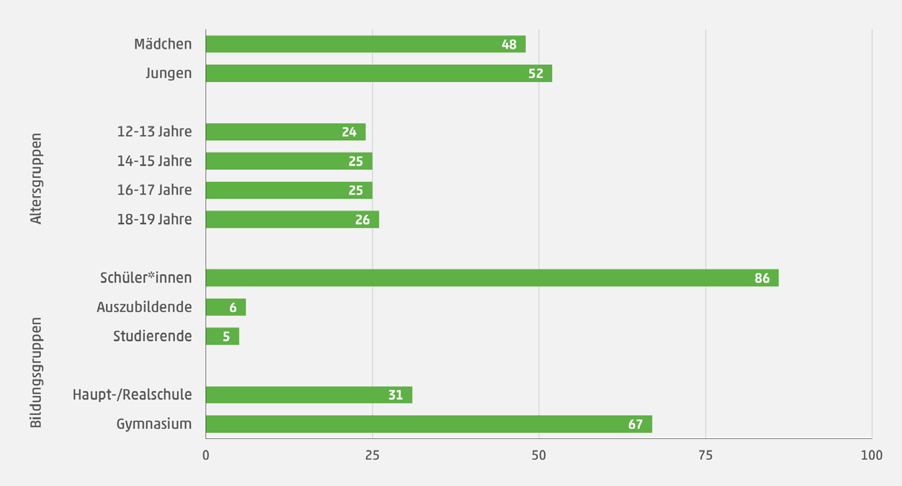

# Theory

Informatik 9. Schulstufe

---

## Themen

- Mediennutzung
- Finanzierung von vermeintlich kostenloser Software
- Datenschutz & Datensicherheit
- Urheberrecht <!-- - Geschichte -->
- Hardware
- Open Source Software
- Betriebssysteme

---

### Mediennutzung

Der [Medienpädagogische Forschungsverbund Südwest](https://mpfs.de) führt seit 1998 Studien zur Mediennutzung in Deutschland durch.

| Studienbezeichnung | Altersspanne | Erscheinungshäufigkeit |
|---|---|---|
| JIM Studie | 12-19 | jährlich               |
| KIM Studie | 6-13  | jedes 2. Jahr          |
| miniKIM    | 2-5   | 2012, 2014, 2020, 2023 |
| SIM-Studie | n/a   | 2021, 2024             |
| FIM-Studie | n/a   | 2011, 2026             |

<!--
JIM: Jugend Information Medien
KIM: Kindheit Internet Medien
SIM: Senior*innen Information Medien
FIM: Familie Interaktion Medien
-->

<!-- _footer: Quelle: https://mpfs.de/studien -->

---

#### Medienpädagogische Forschungsverbund Südwest

- Gegründet: 1998
- Kooperationsprojekt zwischen
    - [Landesanstalt für Kommunikation Baden-Württemberg](https://www.lfk.de/)
    - [Medienanstalt Rheinland-Pfalz](https://medienanstalt-rlp.de/)
    - [SWR (Südwestrundfunk)](https://www.swr.de/)
- Ziel: Erhebung von Basisdaten zum Medienumgang für
    - Medienpädagogik
    - Politik
    - Bildungseinrichtungen

<!-- _footer: Quelle: https://mpfs.de/ueber-uns -->

---

# JIM Studie 2025

- **Stichprobe:** 1200 Jugendliche (12-19) aus Deutschland
- **Versuchszeitraum:** 02.06 - 12.07.2025
- **Methodik:** Telefon und Online Interviews

<!--
footer: Quelle: https://mpfs.de/app/uploads/2025/11/JIM_2025_PDF_barrierearm.pdf
-->

---

## Finanzierung von "gratis" Software

---

## Datenschutz & Datensicherheit

---

## Urheberrecht

---

## Hardware

---

## Open Source Software

---

## Betriebssysteme

