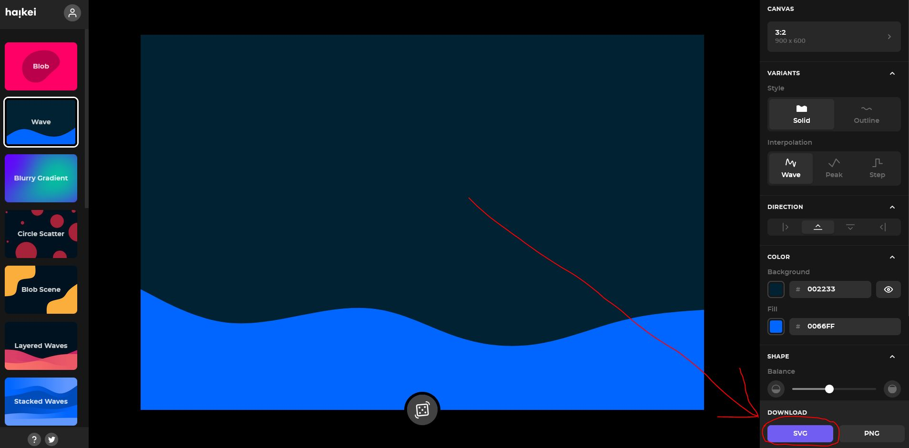
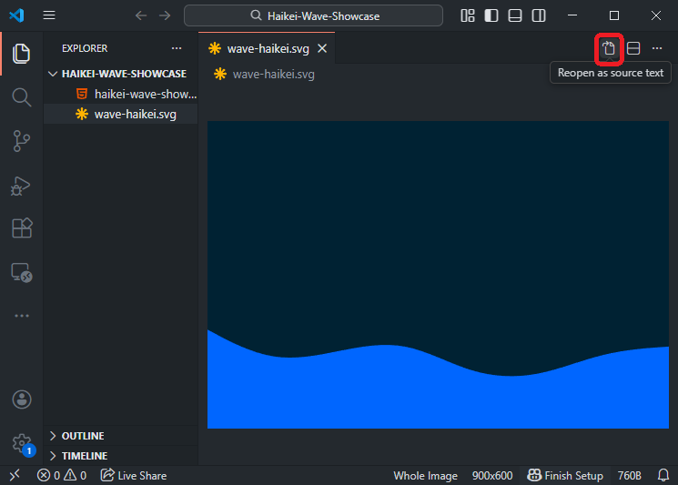
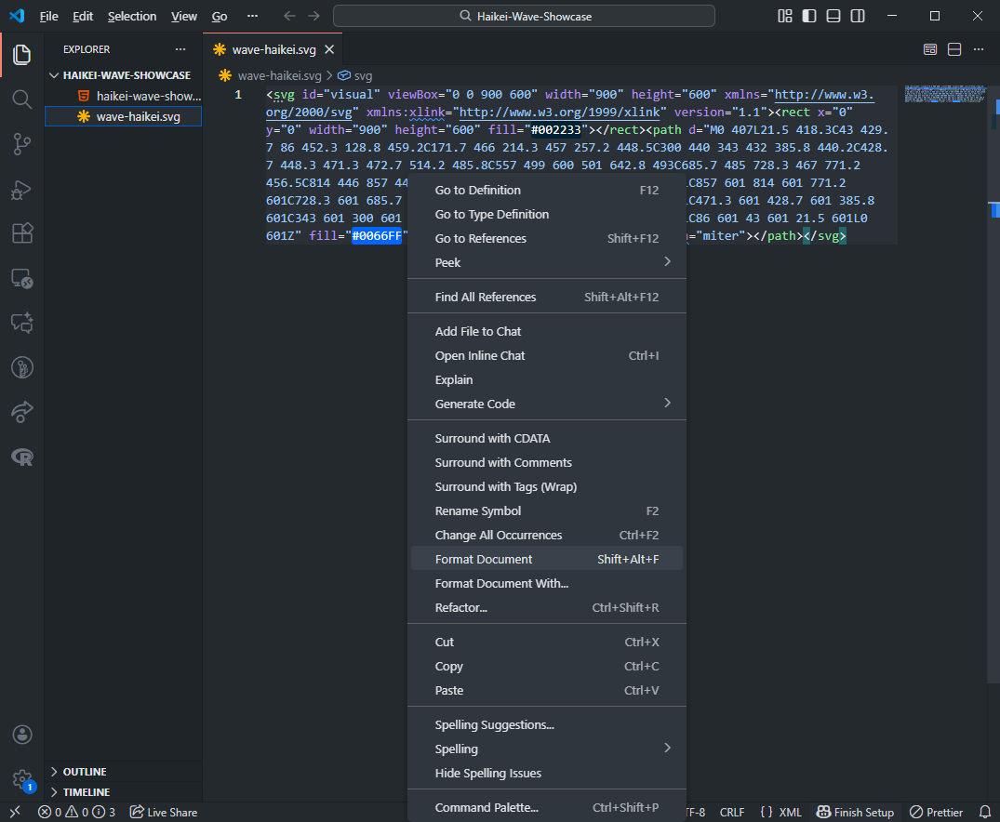
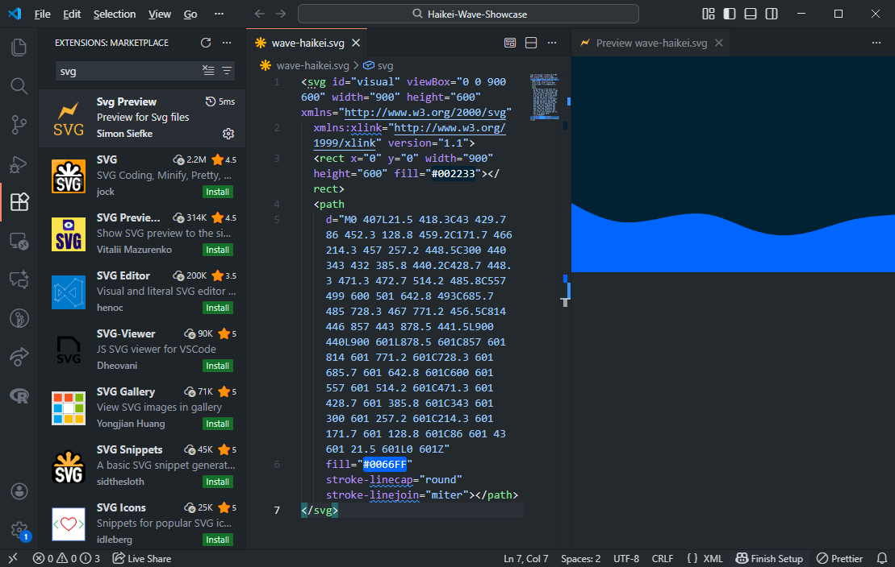
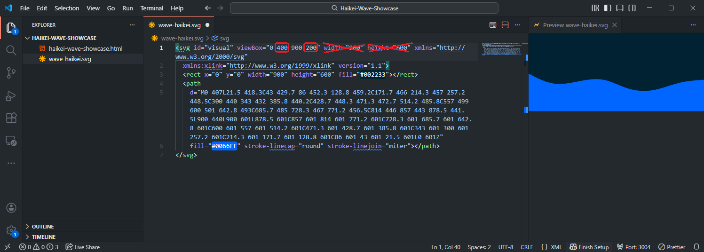
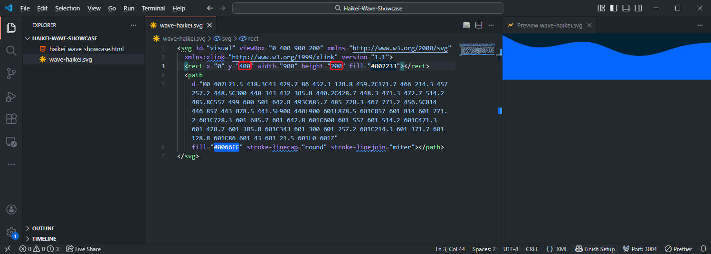

# Haikei Waves verwenden

Martin Kleindienst

---

## Was ist Haikei

- [Haikei](https://app.haikei.app/) ist eine Website zum Erstellen von PNGs und Vektorgrafiken.
- Abgesehen von weniger [Ausnahmen](https://haikei.app/pricing/) kann Haikei dabei frei und sogar kommerziell für Webseiten verwendet werden.
- In diesem Foliensatz sehen wir uns an, wie wir Haikei nutzen können, um (wie in [diesem](https://lakshmigraha-ed.webflow.io/) Beispiel) Wellen als übergänge zwischen Abschnitten einer Website erstellen zu können.

---

## Design auswählen

Zunächst müssen wir uns einmal auf ein Design festlegen und dieses als SVG herunterladen.

---

## Bild im Projektordner abspeichern & öffnen

<ul>
  <li>Als nächstes müssen wir das Bild in unserem Projektordner abspeichern.</li>
  <li>Nun lässt sich das Bild direkt in VS Code bearbeiten.</li>
  <li>Eventuell muss dabei aber der Modus auf "Source Text" geändert werden.</li>
</ul>

---

## Code formatieren

Es empfiehlt sich den Code durch

- Rechtsklick
- Format Document

zu formatieren.

---

## Previewer installieren

Außerdem sollten wir uns eine Extension wie z.B. `Svg Preview` installieren, damit wir direkt sehen, was wir gerade am Bild ändern.

---

## Pfad nach oben schieben

Durch das Verändern der viewBox und dem Entfernen von `width` und `height` können wir die Welle weiter nach oben schieben und damit das Bild niedriger machen.

---

## Hintergrund "verschieben"

Außerdem müssen wir den Hintergrund verkleinern in dem wir das `rect` Element bearbeiten.

---

## Source Code kopieren

Nun können wir den Code in unsere vorbereitete HTML Datei an den gewünschten Stellen hineinkopieren und evtl. auch die Farben anpassen.
