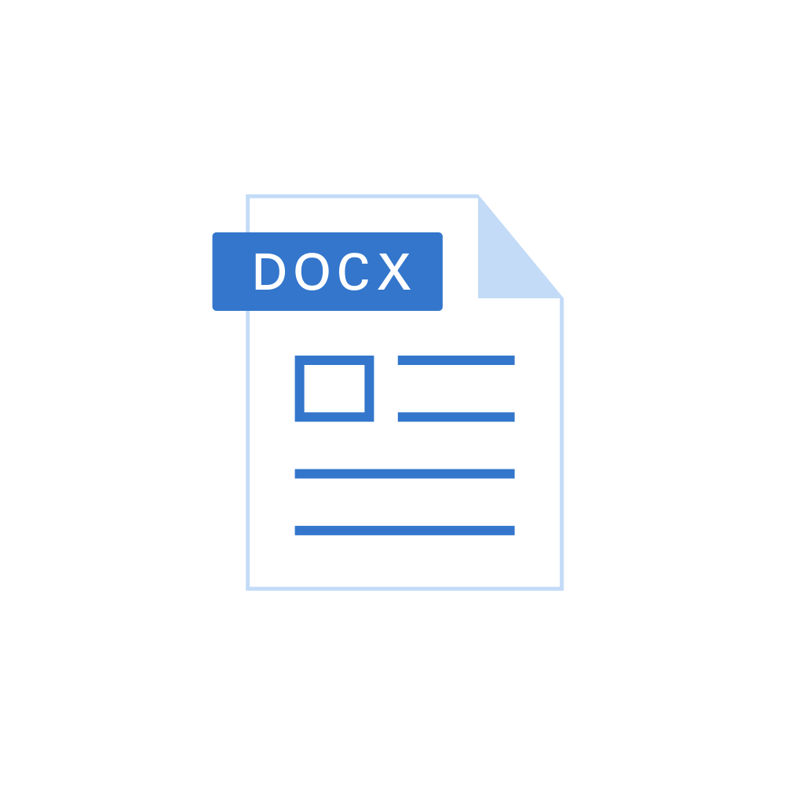

# Überblick

_Martin Kleindienst_

<!--_paginate: false -->

---

## Rules

- Eine Person darf ungefragt aufs WC gehen.
- Es wird nicht herausgerufen sondern immer aufgezeigt.
- Spiele spielen (Roblox, ...) ist nur erlaubt, wenn ich es sage.   **Auch in der Pause!**
- Wenn ich etwas am Beamer erkläre wird geräuschlos aufgepasst und der Bildschirm ausgeschaltet.

---

## Dateiendungen [1]

- Das was im Namen einer Datei nach dem Punkt steht.
- z.B. .docx für Word Dateien, .jpg für Kamerabilder oder .png für Webgrafiken.
- Müssen unter Windows im `Datei Explorer` standardmäßig erst sichtbar geschalten werden.

---

## Dateiendungen [2]

- Was ist der Unterschied zwischen einer **MS Word** Datei
  und einer **Zip** Datei?

- Ändere die Dateiänderung einer **MS Word** Datei auf **.zip** !

---

## Tasten(kombinationen)

- `STRG` + `A`
- `STRG` + `X`
- `STRG` + `C`
- `STRG` + `V`
   
- `STRG` + `Z`
- `STRG` + `Y` oder `STRG` + `SHIFT` + `Z`
     
- `STRG` + `ALT` + `ENTF`

- `STRG` + `S`
- `WINDOWS` + `L`
- `WINDOWS` + `F`
- `WINDOWS` + `P`
- `WINDOWS` + `E`
- `F2`
- `F5`
- `TAB`
- `ALT` + `TAB`

---

### ✏️ Bearbeitung & Text

| Tastenkombination     | Funktion                     |
|------------------------|------------------------------|
| `STRG` + `A`           | Alles markieren              |
| `STRG` + `X`           | Ausschneiden                 |
| `STRG` + `C`           | Kopieren                     |
| `STRG` + `V`           | Einfügen                     |
| `STRG` + `Z`           | Rückgängig machen            |
| `STRG` + `Y`           | Letzte Aktion wiederholen (Office, ...)            |
| `STRG` + `SHIFT` + `Z` | Letzte Aktion wiederholen (Google Docs, ... )|

---

### 🖥️ Systemfunktionen & Dateien

| Tastenkombination         | Funktion                              |
|---------------------------|----------------------------------------|
| `WINDOWS` + `E`           | Datei-Explorer öffnen                 |
| `STRG` + `ALT` + `ENTF`   | Öffnet Sicherheitsmenü         |
| `WINDOWS` + `L`           | Computer sperren                      |
| `STRG` + `S`              | Speichern                             |
| `F2`                      | Datei/Ordner umbenennen               |

---

### 🧭 Navigation & Fenster

| Tastenkombination     | Funktion                                |
|------------------------|------------------------------------------|
| `WINDOWS` + `F`        | Suche öffnen                            |
| `WINDOWS` + `P`        | Einstellungen für mehrere Bildschirme   |
| `F5`                  | Aktualisieren (z. B. Webseite)          |
| `TAB`                 | Zum nächsten Eingabefeld springen        |
| `ALT` + `TAB`         | Zwischen offenen Fenstern wechseln       |

---

## Google Search Operator

- `"genau ẁas ich suchen will"`
- `tokyo hotel band` vs. `tokyo hotel -band`
- `define:grafikkarte`vs. `$grafikkarte`
- `map graz fußball`
- `martin AND kleindienst` vs. `martin OR kleindienst`
- `wheather graz`

<!-- ---

## Regex -->

---

## HTML

<!--  -->

<svg width="1200" height="500" style="position: absolute; z-index: 2; margin-left: -55px; margin-top: -10px">

  <line x1="0" y1="170" x2="693" y2="0" stroke="gray" stroke-width="4"/>
  <line x1="80" y1="170" x2="1200" y2="0" stroke="gray" stroke-width="4" />
  <line x1="00" y1="235" x2="693" y2="450" stroke="gray" stroke-width="4" />
  <line x1="80" y1="235" x2="1200" y2="450" stroke="gray" stroke-width="4" />
</svg>

---

## Image Sources

- https://pixabay.com/vectors/zip-compressed-icon-archive-win-7040223/
- https://pixabay.com/vectors/microsoft-office-word-icon-file-7040222/

